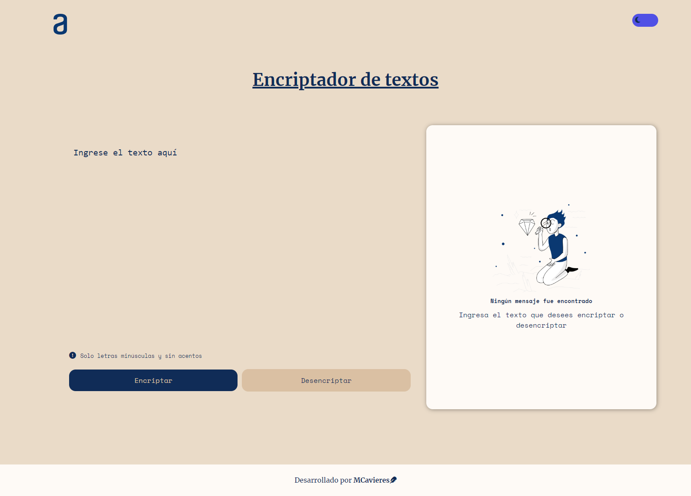
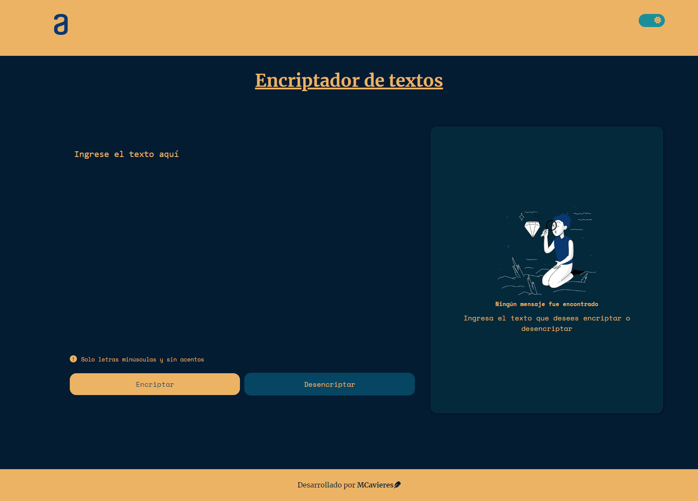

# Challenge Encriptador de texto

El encriptador de texto se centra en encriptar y desencriptar mensajes. Se basa en reemplazar las vocales por otras cadenas de valores, mientas que la desencriptación se basa en el proceso inverso para obtener el mensaje original.

En este challenge se realiza la práctica de tres tecnologías fundamentales para el desarrollo web front end: html, css y javaScript. 
Se trabaja con eventos, funciones, estilos, variables en css y también manipulación del DOM a través de js. Además se le añade un toggle para pasar de modo claro a oscuro y viceversa.

Para ver el proyecto da click [aquí](https://macarenacavieres.github.io/challenge-encriptador/)

## Imágenes proyecto

Modo claro

Modo oscuro

## Tecnologías
- HTML
- CSS
- JavaScript

## Reglas de Encriptación
Las vocales en el texto ingresado se reemplazan según las siguientes reglas:

- `a` se convierte en `ai`
- `e` se convierte en `enter`
- `i` se convierte en `imes`
- `o` se convierte en `ober`
- `u` se convierte en `ufat`

## Dependencias
- Font Awesome: Para los iconos.
- Google Fonts: Para las fuentes de texto.

## Autor

Desarrollado por MCavieres